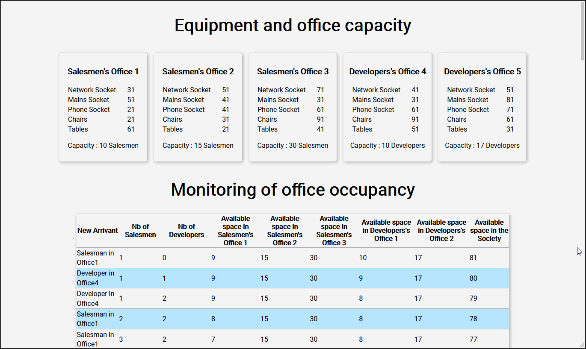

# Hosting_capacity

## Description

Training with PHP - Study of the hosting capacity of a company.

## How it work



## Prerequisites

You'll need a working text editor to read this document.

```
VS Code or Atom would work just fine.....
```


## Built with

- [HTML5](https://developer.mozilla.org/es/docs/HTML/HTML5)
- [CSS3](https://developer.mozilla.org/en-US/docs/Archive/CSS3)
- [PHP](https://www.php.net/)

